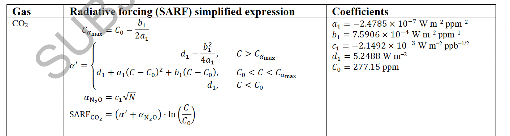
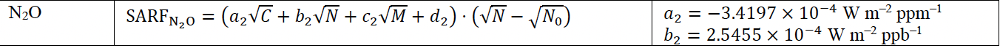
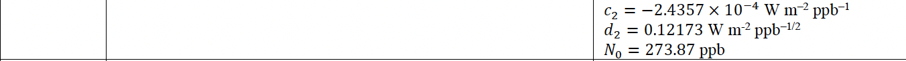

# Objective 

Here we are comparing Hector's RF with the RF results from AR6 the objectives of the document are as follows 

* validate the update to the AR6 RF modeling 
* where Hector v3 and AR6 RF values are not identical determine why


## Set Up 

```{r setup, include=FALSE}
knitr::opts_chunk$set(echo = TRUE, warning = FALSE, message = FALSE)
```

```{r, warning=FALSE, message = FALSE}
library(data.table)
library(dplyr)
library(ggplot2)
library(hector)
library(knitr)
library(kableExtra)
library(tidyr)

theme_set(theme_bw())

DIR <- "/Users/dorh012/Documents/2021/2021-hector-ar6rf"
```


## Hector Results

```{r}
run_hector_ssp <- function(ini){
    
    vars <- c(RF_CO2(), RF_CH4(), RF_N2O(), RF_O3_TROP(), RF_H2O_STRAT(), RF_ACI(),
              RF_VOL(), RF_TOTAL(), RF_HFC134A(), RF_HFC23(),
              RF_HFC32(), RF_HFC125(), RF_HFC143A(), RF_HFC227EA(), RF_HFC245FA(),
              RF_SF6(), RF_CF4(), RF_CFC11(),
              RF_CFC113(), RF_CFC114(), RF_CFC115(), RF_BC(), RF_SO2(), 
              RF_OC(), RF_NH3(), ATMOSPHERIC_N2O(), GLOBAL_TEMP(), RF_T_ALBEDO(), 
              RF_CF4(), RF_C2F6(), RF_HFC23(), RF_HFC32(), RF_HFC4310(), RF_HFC125(),
              RF_HFC134A(), RF_HFC143A(), RF_HFC227EA(), RF_HFC245FA(), RF_SF6(),
              RF_CFC11(), RF_CFC12(), RF_CFC113(), RF_CFC114() , RF_CFC115(), RF_CCL4(),
              RF_CH3CCL3(), RF_HCFC22(), RF_HCFC141B(), RF_HCFC142B(), RF_HALON1211(), 
              RF_HALON1301(), RF_HALON2402(), RF_CH3CL(), RF_CH3BR(), ATMOSPHERIC_CH4(), RF_MISC(),
              GLOBAL_TEMP()) 
    
    name <- gsub(pattern = "hector_|.ini", replacement = "", x = basename(ini))
    core <- newcore(ini, name = name)
    run(core, runtodate = 2100)
    out <- fetchvars(core, 1745:2100, vars)
    
    return(out)
    
}

list.files(file.path(DIR, "input"), pattern = "ini", full.names = TRUE) %>% 
  lapply(run_hector_ssp) %>% 
  bind_rows() %>%  
  mutate(driven = ifelse(grepl(pattern = "-GHG", scenario), "GHG", "emiss")) %>% 
  mutate(driven = ifelse(grepl(pattern = "-rf", scenario), "RF", driven)) %>% 
  mutate(scenario = gsub(pattern = "-rf", replacement = "", x = scenario)) %>%  
  mutate(scenario = gsub(pattern = "-GHG", replacement = "", x = scenario))-> 
  hector_out
hector_out$source <- "Hector"

hector_out %>% 
  dplyr::filter(variable %in% c(RF_BC(), RF_OC(), RF_SO2(), RF_NH3())) %>% 
  group_by(scenario, year, driven, source) %>% 
  summarise(value = sum(value)) %>% 
  ungroup %>% 
  mutate(variable = "ari") %>% 
  bind_rows(hector_out) -> 
  hector_out

hector_out$version <- 3

hector_old <- read.csv(file.path(DIR, "Hector_25.csv"), stringsAsFactors = FALSE)

hector_out %>% 
  filter(driven == "emiss") %>% 
  select(scenario, year, value, variable, units, version) %>% 
  bind_rows(hector_old) -> 
  hector_v_hector
```

## AR6 Results

```{r, warning=FALSE, message=FALSE}
format_data <- function(path){
  
  x <- gsub(pattern = ".csv", replacement = "", x = basename(path))
  xx <- unlist(strsplit(x, split = "_"))
  
  if (length(xx) == 3 ){
    out <- as.data.frame(matrix(xx, nrow = 1, dimnames = list(NULL, c("output", "scn", "time"))))
  }
  
  if (length(xx) == 4 ){
    out <- as.data.frame(matrix(xx, nrow = 1, dimnames = list(NULL, c("output", "scn", "time", "percent"))))
  }
  
  return(out)
  
}

get_cmip_data <- function(path){
  
  dat <- read.csv(path, stringsAsFactors = FALSE)
  info <- format_data(path)
  
  dat %>% 
    melt(id.vars = c( "year"), 
         variable.name = "variable", value.name = "value") %>% 
    cbind(info) -> 
    out
  
  return(out)
}

files   <- list.files(file.path(DIR,"SSPs"), pattern = "ERF", full.names = TRUE)  

files %>% 
    lapply(get_cmip_data) %>% 
    bind_rows() %>% 
    select(year, variable, value, scenario = scn, percent) %>% 
    as.data.table() %>% 
    dplyr::filter(is.na(percent))  -> 
    ar6_data_og

ar6_names <- c("co2","ch4","n2o","o3","h2o_stratospheric","aerosol.cloud_interactions",
               "volcanic","total", "HFC.134a","HFC.23","HFC.32","HFC.125","HFC.143a", 
               "HFC.227ea", "HFC.245fa", "SF6","CF4","CFC.11", "CFC.113", 
               "CFC.114", "CFC.115", "land_use", "solar", "bc_on_snow", "contrails",
               "aerosol.radiation_interactions")
hector_names <- c(RF_CO2(), RF_CH4(), RF_N2O(), RF_O3_TROP(), RF_H2O_STRAT(), RF_ACI(),
                  RF_VOL() ,RF_TOTAL(), RF_HFC134A(),RF_HFC23(), RF_HFC32(), RF_HFC125(),
                  RF_HFC143A(), RF_HFC227EA(), RF_HFC245FA(), RF_SF6(), RF_CF4(),
                  RF_CFC11(), RF_CFC113(), RF_CFC114(), RF_CFC115(), RF_T_ALBEDO(), 
                  RF_MISC(), RF_MISC(), RF_MISC(), "ari") 

ar6_data_og %>% 
  filter(variable %in% ar6_names) %>%
  left_join(data.frame(variable = ar6_names, 
                       hvar = hector_names)) %>% 
  select(year, variable = hvar, value, scenario) %>%  
  filter(scenario %in% hector_out$scenario) %>% 
  mutate(driven = "AR6") %>% 
  group_by(year, variable, scenario, driven) %>%  
  summarise(value = sum(value)) %>%  
  ungroup -> 
  ar6_results_1

# Read in and format the halo-carbon RF. 

files   <- list.files(file.path(DIR,"SSPs"), pattern = "minorGHGs", full.names = TRUE)  

lapply(files, function(x){
  
  name <- gsub(x = basename(x), pattern = "ERF_|_minorGHGs_1750-2500.csv", replacement = "" )

read.csv(x) %>% 
  as.data.table() %>%
  pivot_longer(!year, names_to = "variable", values_to = "value") %>% 
  mutate(variable = gsub(pattern = "\\.", replacement = "", x = variable)) %>%
  mutate(variable = paste0("F", variable)) %>%
  mutate(variable = ifelse(grepl(pattern = "Halon", variable), 
                           gsub(replacement = "halon", pattern = "Halon", variable), variable)) %>% 
  mutate(scenario = name)
  
}) %>% 
  bind_rows() -> 
  ar6_results_2

  
ar6_results <- bind_rows(ar6_results_1, ar6_results_2)
ar6_results$source <- "AR6"
ar6_results$driven <- "AR6"

# A data frame of the hector annd AR6 output results! 
data <- bind_rows(hector_out, ar6_results) 
```


```{r}
# Figure out the percent difference btween the Hector and AR6 results! 
data %>%  
  filter(driven == "AR6" & source == "AR6") %>%  
  select(scenario, year, variable, AR6 = value) %>% 
  distinct() -> 
  AR6_variable_output

# Calculate the percent difference from the AR6 output. 
data %>%
  filter(driven %in% c("emiss", "GHG")) %>% 
  full_join(AR6_variable_output) %>% 
  select(scenario, year, driven, value, variable, AR6) %>% 
  na.omit() %>% 
  mutate(value = 100 * (value - AR6) / AR6) %>% 
  select(scenario, year, driven, value, variable) %>% 
  mutate(units = "% diff. from AR6 output") %>% 
  mutate(scenario = if_else(year < 2014, "historical", scenario)) -> 
  percent_difference
  
# How much of the total RF does the difference represent? 
data %>%  
  filter(driven == "AR6" & source == "AR6") %>%  
  filter(variable == RF_TOTAL()) %>% 
  select(scenario, year, AR6_total = value) %>% 
  distinct() -> 
  AR6_total

# Now calculate how much of the total AR6 RF does this represent? 
data %>%
  filter(driven %in% c("emiss", "GHG")) %>% 
  full_join(AR6_variable_output) %>% 
  select(scenario, year, driven, value, variable, AR6) %>% 
  na.omit() %>% 
  left_join(AR6_total) %>% 
  mutate(value = 100 * (value - AR6)/ AR6_total) %>%  
  select(scenario, year, driven, value, variable) %>% 
  mutate(units = "% diff. / AR6 total") -> 
  percent_diff_of_totals

```

# Big Picture

* RF CO2  `r emo::ji("question")`
* RF N2O  `r emo::ji("question")`
* RF CH4  `r emo::ji("check")`
* RF O3 Trop  `r emo::ji("ok")` no update in Hector
* RF H2O strat  `r emo::ji("question")` looks okay historical not great in the future periods
* RF Faci `r emo::ji("thumbs down")`
* RF Ari  `r emo::ji("ok")`
* RF Fvol  `r emo::ji("check")`
* RF F halocarbons  `r emo::ji("ok")`
* RF Falbedo  `r emo::ji("check")`
* RF Fmisc `r emo::ji("check")`


## Total RF & Temperature 

How much does total RF differ by and what does that mean in terms of temperature? 

```{r}
hector_out %>% 
  filter(variable %in% c(RF_TOTAL(), GLOBAL_TEMP())) %>% 
  mutate(driven = if_else(driven == "RF", "AR6", driven)) %>%
  ggplot() + 
  geom_line(aes(year, value, color = driven, groupby = scenario)) + 
  labs(title = "AR6 vs Hector Comparison", 
       x = "Year") + 
  facet_wrap("variable", scales = "free") +
  theme(legend.title = element_blank())
```


The differnces in total RF results in a temperature that differ by a tenth of a degree. 

```{r}
hector_out %>% 
  filter(variable %in% c(RF_TOTAL(), GLOBAL_TEMP())) %>% 
  mutate(driven = if_else(driven == "RF", "AR6", driven)) %>%
  select(scenario, year, driven, value, variable) %>% 
  distinct() %>% 
  spread(driven, value) %>% 
  mutate(emiss = (emiss - AR6), 
         GHG =  (GHG - AR6)) %>% 
  ggplot() + 
  geom_line(aes(year, emiss, groupby = scenario, linetype = scenario, color = "emiss")) + 
  geom_line(aes(year, GHG, groupby = scenario, linetype = scenario, color = "GHG")) + 
  labs(x = "Year", 
       y = "Difference") + 
  facet_wrap("variable", scales = "free") 
```


What does the percent difference look like? 

```{r}
hector_out %>% 
  filter(variable %in% c(RF_TOTAL(), GLOBAL_TEMP())) %>% 
  mutate(driven = if_else(driven == "RF", "AR6", driven)) %>%
  select(scenario, year, driven, value, variable) %>% 
  distinct() %>% 
  spread(driven, value) %>% 
  mutate(emiss =  100 * (emiss - AR6) / AR6, 
         GHG =  100 * (GHG - AR6) / AR6) %>% 
  pivot_longer(c(emiss, GHG), names_to = "driven", values_to = "value") -> 
  difference_tgav_rf
```


```{r}
difference_tgav_rf %>% 
  filter(year >= 2014) %>% 
  distinct() %>% 
  ggplot() + 
  geom_line(aes(year, value, color = driven, groupby = scenario, linetype = scenario)) + 
  labs(title = "(X - AR6)/AR6", 
       x = "Year", 
       y = "%") + 
  facet_wrap("variable") 
```

A 5 % change in the future global temperature. 

```{r}
percent_difference %>% 
  filter(variable == RF_TOTAL()) %>% 
  group_by(scenario, variable, units, driven) %>% 
  summarise(mean = mean(value, na.rm = TRUE)) %>% 
  pivot_wider(names_from = driven, values_from = mean) %>% 
  kable(digits = 3) %>% 
  kable_styling()
```


What is our biggest problem??? Ignoring the historical period for now.


```{r}
percent_diff_of_totals %>%
  filter(year >= 2018) %>% 
  filter(driven == "GHG") %>% 
  filter(variable != RF_TOTAL()) %>% 
  ggplot(aes(year, value, color = variable, groupby = scenario)) + 
  geom_line()
```


Which of the differnces between Hector & AR6 RF makes up the largest portion or percentage of the total AR6 RF. 

```{r}
percent_diff_of_totals %>%
  filter(driven == "GHG" & variable != RF_TOTAL()) %>% 
  filter(year > 2016) %>% 
  group_by(scenario, variable) %>% 
  summarise(mean = mean(value), sd = sd(value)) %>% 
  ungroup %>% 
  group_by(variable) %>% 
  summarise(mean = mean(mean)) %>% 
  arrange(desc(abs(mean))) %>% 
  kable() %>% 
  kable_styling()
```


The top four culprits is the forcing from cloud interactions (F aci), CO2, N2O, and trop O3. What would be really helpful would be for you to take a look and provide input, do you think these discrepancies are large enough to be a problem? Or are we okay with them?  

# Major GHGs 


Let's take a look at the major GHGs, CO2, N2O, and CH4. For these plots we are intrested in comparing the AR6 results vs the concentration driven Hector (the GHG plot in the runs). The purpose here is to show that the we have implented the AR6's concentration to RF step for these three GHGs correctly.  


## CO2 

```{r}
data %>% 
  filter(variable == RF_CO2()) %>%  
  filter(year <= 2100) %>% 
  filter(driven %in% c("GHG", "AR6")) %>% 
  ggplot(aes(year, value, color = driven, linetype = driven, groupby = scenario)) +
  geom_line()
```


The percent difference between CO2 constrained Hector & AR6 CO2 RF. Honestly the difference of 2% in RF is more than I was expecting espcially since the concentration values are identical & we are using the same functional form at the AR6 report so it is surprising to me that we would see this level of difference, does not seem like just numerical error and since CO2 RF is such a large and important part of the overall RF balance I am conflicted. I have double and tripple checked, BBL & SJS what do you think? 

```{r}

data %>% 
  filter(variable == RF_CO2()) %>%  
  filter(year <= 2100) %>% 
  filter(year != 2015) %>% 
  filter(driven %in% c("GHG", "AR6")) %>% 
  mutate(scenario = if_else(year <= 2015, "historical", scenario)) %>% 
  select(scenario, year, driven, value, variable) %>% 
  distinct() %>%  
  spread(driven, value) %>%
  mutate(percent =  100 * (GHG - AR6)/AR6) %>% 
  ggplot(aes(year, percent)) + 
  geom_line()
```


Here is the functional form for the CO2 RF with the parameters if that is something that interests you 




## N2O 

```{r}
var <- RF_N2O()
data %>% 
  dplyr::filter(variable == var) %>%  
  dplyr::filter(year <= 2100) %>% 
  dplyr::filter(driven %in% c("GHG", "AR6")) %>% 
  ggplot(aes(year, value, color = driven, linetype = driven, groupby = scenario)) +
  geom_line() + 
  labs(title = var)
```


The percent difference bewtween Hector `r var` and AR6 `r var`. 

```{r}
percent_difference %>%
  dplyr::filter(variable == RF_N2O()) %>%
  dplyr::filter(driven == "GHG") %>%
  group_by(scenario, driven, variable) %>%
  summarise(value = mean(value, na.rm = TRUE))
```


The difference bewtween Hector `r var` and AR6 `r var` compared to the total AR6 RF. 


```{r}
percent_diff_of_totals %>%
  filter(variable == var & driven == "GHG") %>%
  group_by(scenario, driven, variable) %>%
  summarise(value = mean(value, na.rm = TRUE))
```


So it is not great that Hector under estimated RF by 4 percent out of total RF it is somewhat small. Regardless I am not thrilled by how different it is. 

Looking over the constants values and the functional form from the IPCC AR6 report. 




I am at a lost as to what is wrong, but BBL & SJS what do you think? Do you have any ideas as to what could be wrong? Do you thikn it is a problem? 


## CH4 

```{r}
var <- RF_CH4()
data %>% 
  filter(variable == var) %>%  
  filter(year <= 2100) %>% 
  filter(driven %in% c("GHG", "AR6")) %>% 
  ggplot(aes(year, value, color = driven, linetype = driven, groupby = scenario)) +
  geom_line() + 
  labs(title = var)
```

Because the percent error is different on the concentration drien run I am less than thrilled what could be causing this probelm? Either an incorect functional form or some issue with convverting the N2O units to the N which is what we use with Hector. 

Eyeballing it it the CH4 output looks great, and the percent differnce between AR6 & Hector CH4 RF is  less than 1% in the future scenarios 

```{r}
percent_difference %>%  
  filter(variable == var & driven == "GHG") %>%  
  mutate(scenario = if_else(year <= 2015, "historical", scenario)) %>% 
  distinct() %>% 
  ungroup() %>% 
  group_by(scenario, driven, variable) %>% 
  summarise(value = mean(value, na.rm = TRUE))
```

Comparing the difference betwee the Hector CH4 RF and AR6 CH4 RF compared to the total AR6 RF this is a really small percent. 

```{r}
percent_diff_of_totals %>%  
  filter(variable == var & driven == "GHG") %>%  
  mutate(scenario = if_else(year <= 2015, "historical", scenario)) %>% 
  distinct() %>% 
  ungroup() %>% 
  group_by(scenario, driven, variable) %>% 
  summarise(value = mean(value, na.rm = TRUE))
```

# Minor GHGs 

## FO3_trop

```{r}
var <- RF_O3_TROP()
data %>% 
  filter(variable == var) %>%  
  filter(year <= 2100) %>% 
  filter(driven %in% c("GHG", "emiss")) %>% 
  ggplot(aes(year, value, color = scenario, linetype = driven, groupby = scenario)) +
  geom_line() + 
  labs(title = var)
```

The percent difference bewtween Hector `r var` and AR6 `r var`. 

```{r}
percent_difference %>%  
  filter(variable == var & driven == "GHG") %>%  
  group_by(scenario, driven, variable) %>% 
  summarise(value = mean(value, na.rm = TRUE))
```

The difference bewtween Hector `r var` and AR6 `r var` compared to the total AR6 RF. 

```{r}
percent_diff_of_totals %>%  
  filter(variable == var & driven == "GHG") %>%  
  group_by(scenario, driven, variable) %>% 
  summarise(value = mean(value, na.rm = TRUE))
```


Troposphere O3 doesn't look great, all though this discrepancy overall makes up a small percentage of the total RF. 

## FH2O_strat

AR6 did not do an update, here we scaled estimates to AR6 in 2014 with the 2014 methane concentration. We used this relationship to estimate RF. While this works well for the historical and some of the future scearios it is does not work equally well for some of the larger EOC RF. 

```{r}
var <- RF_H2O_STRAT()
data %>% 
  filter(variable == var) %>%  
  filter(year <= 2100) %>% 
  filter(driven %in% c("GHG", "AR6")) %>% 
  ggplot(aes(year, value, color = scenario, linetype = driven, groupby = scenario)) +
  geom_line() + 
  labs(title = var)
```

The percent difference bewtween Hector `r var` and AR6 `r var`. 

```{r}
percent_difference %>%  
  filter(variable == var & driven == "GHG") %>%  
  group_by(scenario, driven, variable) %>% 
  summarise(value = mean(value, na.rm = TRUE))
```

The difference bewtween Hector `r var` and AR6 `r var` compared to the total AR6 RF. 

```{r}
percent_diff_of_totals %>%  
  filter(variable == var & driven == "GHG") %>%  
  group_by(scenario, driven, variable) %>% 
  summarise(value = mean(value, na.rm = TRUE))
```


# Aerosols 

## Faci

ERF from aerosol-cloud interactions (ERFaci) Equation 7.SM.1.2 

ERF aci = - beta (1 + emissions SO2/param SO2 + (emissions BC + OC) / param BCOC)

```{r}
var <- RF_ACI()
data %>% 
  filter(variable == var) %>%  
  filter(year <= 2100) %>% 
  filter(driven %in% c("emiss", "AR6")) %>% 
  ggplot(aes(year, value, color = scenario, linetype = driven, groupby = scenario)) +
  geom_vline(xintercept = 2015, alpha = 0.4) + 
  geom_line() + 
  labs(title = var) 
```

The percent difference bewtween Hector `r var` and AR6 `r var`. 

```{r}
percent_difference %>%  
  filter(variable == var & driven == "emiss") %>%  
  group_by(scenario, driven, variable) %>% 
  summarise(value = mean(value, na.rm = TRUE))
```

The difference bewtween Hector `r var` and AR6 `r var` compared to the total AR6 RF. 

```{r}
percent_diff_of_totals %>%  
  filter(variable == var & driven == "emiss") %>%  
  group_by(scenario, driven, variable) %>% 
  summarise(value = mean(value, na.rm = TRUE))
```

This does not look good, because the ari looks especially during the futture period it where we know that we used the same emission leads be to conclude that this is not being caused by a difference in emissions. Which leads me to belive it has to do with a parameter value? SJS do you have any ideas? 


## Ari  

ERF ari = (beta BC)(emissions BC) + (beta OC)(emissions OC) + (beta NH3)(emissions NH3) : Equation 7.SM.1.1

```{r}
var <- "ari"
data %>% 
  filter(variable == var) %>%  
  filter(year <= 2100) %>% 
  filter(driven %in% c("emiss", "AR6")) %>% 
  ggplot(aes(year, value, color = driven, linetype = driven, groupby = scenario)) +
  geom_vline(xintercept = 2015, alpha = 0.4) + 
  geom_line() + 
  labs(title = var) 
```

The percent difference bewtween Hector `r var` and AR6 `r var`. 

```{r}
percent_difference %>%  
  filter(variable == var) %>%  
  group_by(scenario, driven, variable) %>% 
  summarise(value = mean(value, na.rm = TRUE))
```

So it is not surprising to me that that the largest difference between Hector and the AR6 outputs because it sounds like we might have have used different historic time sereis for areosol emissions. 


The difference bewtween Hector `r var` and AR6 `r var` compared to the total AR6 RF. 

```{r}
percent_diff_of_totals %>%  
  filter(variable == var & driven == "emiss") %>%  
  group_by(scenario, driven, variable) %>% 
  summarise(value = mean(value, na.rm = TRUE))
```


# Halocarbons 

## FHFC134a 

```{r}
var <- "FHFC134a"

data %>% 
  filter(variable == var) %>%  
  filter(year <= 2100) %>% 
  filter(driven %in% c("emiss", "AR6")) %>% 
  ggplot(aes(year, value, color = driven, linetype = driven, groupby = scenario)) +
  geom_line() + 
  labs(title = var)
```

The percent difference bewtween Hector `r var` and AR6 `r var`. 

```{r}
percent_difference %>%  
  filter(variable == var & driven == "emiss") %>%  
  group_by(scenario, driven, variable) %>% 
  summarise(value = mean(value, na.rm = TRUE))
```

The difference bewtween Hector `r var` and AR6 `r var` compared to the total AR6 RF. 

```{r}
percent_diff_of_totals %>%  
  filter(variable == var & driven == "emiss") %>%  
  group_by(scenario, driven, variable) %>% 
  summarise(value = mean(value, na.rm = TRUE))
```


## FHFC23 

```{r}
var <- "FHFC23"

data %>% 
  filter(variable == var) %>%  
  filter(year <= 2100) %>% 
  filter(driven %in% c("emiss", "AR6")) %>% 
  ggplot(aes(year, value, color = driven, linetype = driven, groupby = scenario)) +
  geom_line() + 
  labs(title = var)
```

The percent difference bewtween Hector `r var` and AR6 `r var`. 

```{r}
percent_difference %>%  
  filter(variable == var & driven == "emiss") %>%  
  group_by(scenario, driven, variable) %>% 
  summarise(value = mean(value, na.rm = TRUE))
```

The difference bewtween Hector `r var` and AR6 `r var` compared to the total AR6 RF. 

```{r}
percent_diff_of_totals %>%  
  filter(variable == var & driven == "emiss") %>%  
  group_by(scenario, driven, variable) %>% 
  summarise(value = mean(value, na.rm = TRUE))
```


## FHFC32 

```{r}
var <- "FHFC32"

data %>% 
  filter(variable == var) %>%  
  filter(year <= 2100) %>% 
  filter(driven %in% c("emiss", "AR6")) %>% 
  ggplot(aes(year, value, color = driven, linetype = driven, groupby = scenario)) +
  geom_line() + 
  labs(title = var)
```

The percent difference bewtween Hector `r var` and AR6 `r var`. 

```{r}
percent_difference %>%  
  filter(variable == var & driven == "emiss") %>%  
  group_by(scenario, driven, variable) %>% 
  summarise(value = mean(value, na.rm = TRUE))
```

The difference bewtween Hector `r var` and AR6 `r var` compared to the total AR6 RF. 

```{r}
percent_diff_of_totals %>%  
  filter(variable == var & driven == "emiss") %>%  
  group_by(scenario, driven, variable) %>% 
  summarise(value = mean(value, na.rm = TRUE))
```

## FHFC125 

```{r}
var <- "FHFC125"

data %>% 
  filter(variable == var) %>%  
  filter(year <= 2100) %>% 
  filter(driven %in% c("emiss", "AR6")) %>% 
  ggplot(aes(year, value, color = driven, linetype = driven, groupby = scenario)) +
  geom_line() + 
  labs(title = var)
```

The percent difference bewtween Hector `r var` and AR6 `r var`. 

```{r}
percent_difference %>%  
  filter(variable == var & driven == "emiss") %>%  
  group_by(scenario, driven, variable) %>% 
  summarise(value = mean(value, na.rm = TRUE))
```

The difference bewtween Hector `r var` and AR6 `r var` compared to the total AR6 RF. 

```{r}
percent_diff_of_totals %>%  
  filter(variable == var & driven == "emiss") %>%  
  group_by(scenario, driven, variable) %>% 
  summarise(value = mean(value, na.rm = TRUE))
```


## FHFC143a 

```{r}
var <- "FHFC143a"

data %>% 
  filter(variable == var) %>%  
  filter(year <= 2100) %>% 
  filter(driven %in% c("emiss", "AR6")) %>% 
  ggplot(aes(year, value, color = driven, linetype = driven, groupby = scenario)) +
  geom_line() + 
  labs(title = var)
```

The percent difference bewtween Hector `r var` and AR6 `r var`. 

```{r}
percent_difference %>%  
  filter(variable == var & driven == "emiss") %>%  
  group_by(scenario, driven, variable) %>% 
  summarise(value = mean(value, na.rm = TRUE))
```

The difference bewtween Hector `r var` and AR6 `r var` compared to the total AR6 RF. 

```{r}
percent_diff_of_totals %>%  
  filter(variable == var & driven == "emiss") %>%  
  group_by(scenario, driven, variable) %>% 
  summarise(value = mean(value, na.rm = TRUE))
```


## FHFC227ea 

```{r}
var <- "FHFC227ea"

data %>% 
  filter(variable == var) %>%  
  filter(year <= 2100) %>% 
  filter(driven %in% c("emiss", "AR6")) %>% 
  ggplot(aes(year, value, color = driven, linetype = driven, groupby = scenario)) +
  geom_line() + 
  labs(title = var)
```

The percent difference bewtween Hector `r var` and AR6 `r var`. 

```{r}
percent_difference %>%  
  filter(variable == var & driven == "emiss") %>%  
  group_by(scenario, driven, variable) %>% 
  summarise(value = mean(value, na.rm = TRUE))
```

The difference bewtween Hector `r var` and AR6 `r var` compared to the total AR6 RF. 

```{r}
percent_diff_of_totals %>%  
  filter(variable == var & driven == "emiss") %>%  
  group_by(scenario, driven, variable) %>% 
  summarise(value = mean(value, na.rm = TRUE))
```


## FHFC245fa 

```{r}
var <- "FHFC245fa"

data %>% 
  filter(variable == var) %>%  
  filter(year <= 2100) %>% 
  filter(driven %in% c("emiss", "AR6")) %>% 
  ggplot(aes(year, value, color = driven, linetype = driven, groupby = scenario)) +
  geom_line() + 
  labs(title = var)
```

The percent difference bewtween Hector `r var` and AR6 `r var`. 

```{r}
percent_difference %>%  
  filter(variable == var & driven == "emiss") %>%  
  group_by(scenario, driven, variable) %>% 
  summarise(value = mean(value, na.rm = TRUE))
```

The difference bewtween Hector `r var` and AR6 `r var` compared to the total AR6 RF. 

```{r}
percent_diff_of_totals %>%  
  filter(variable == var & driven == "emiss") %>%  
  group_by(scenario, driven, variable) %>% 
  summarise(value = mean(value, na.rm = TRUE))
```


## FSF6 

```{r}
var <- "FSF6"

data %>% 
  filter(variable == var) %>%  
  filter(year <= 2100) %>% 
  filter(driven %in% c("emiss", "AR6")) %>% 
  ggplot(aes(year, value, color = driven, linetype = driven, groupby = scenario)) +
  geom_line() + 
  labs(title = var)
```

The percent difference bewtween Hector `r var` and AR6 `r var`. 

```{r}
percent_difference %>%  
  filter(variable == var & driven == "emiss") %>%  
  group_by(scenario, driven, variable) %>% 
  summarise(value = mean(value, na.rm = TRUE))
```

The difference bewtween Hector `r var` and AR6 `r var` compared to the total AR6 RF. 

```{r}
percent_diff_of_totals %>%  
  filter(variable == var & driven == "emiss") %>%  
  group_by(scenario, driven, variable) %>% 
  summarise(value = mean(value, na.rm = TRUE))
```


## FCF4 

```{r}
var <- "FCF4"

data %>% 
  filter(variable == var) %>%  
  filter(year <= 2100) %>% 
  filter(driven %in% c("emiss", "AR6")) %>% 
  ggplot(aes(year, value, color = driven, linetype = driven, groupby = scenario)) +
  geom_line() + 
  labs(title = var)
```

The percent difference bewtween Hector `r var` and AR6 `r var`. 

```{r}
percent_difference %>%  
  filter(variable == var & driven == "emiss") %>%  
  group_by(scenario, driven, variable) %>% 
  summarise(value = mean(value, na.rm = TRUE))
```

The difference bewtween Hector `r var` and AR6 `r var` compared to the total AR6 RF. 

```{r}
percent_diff_of_totals %>%  
  filter(variable == var & driven == "emiss") %>%  
  group_by(scenario, driven, variable) %>% 
  summarise(value = mean(value, na.rm = TRUE))
```


## FCFC11 

```{r}
var <- "FCFC11"

data %>% 
  filter(variable == var) %>%  
  filter(year <= 2100) %>% 
  filter(driven %in% c("emiss", "AR6")) %>% 
  ggplot(aes(year, value, color = driven, linetype = driven, groupby = scenario)) +
  geom_line() + 
  labs(title = var)
```

The percent difference bewtween Hector `r var` and AR6 `r var`. 

```{r}
percent_difference %>%  
  filter(variable == var & driven == "emiss") %>%  
  group_by(scenario, driven, variable) %>% 
  summarise(value = mean(value, na.rm = TRUE))
```

The difference bewtween Hector `r var` and AR6 `r var` compared to the total AR6 RF. 

```{r}
percent_diff_of_totals %>%  
  filter(variable == var & driven == "emiss") %>%  
  group_by(scenario, driven, variable) %>% 
  summarise(value = mean(value, na.rm = TRUE))
```


## FCFC113 

```{r}
var <- "FCFC113"

data %>% 
  filter(variable == var) %>%  
  filter(year <= 2100) %>% 
  filter(driven %in% c("emiss", "AR6")) %>% 
  ggplot(aes(year, value, color = driven, linetype = driven, groupby = scenario)) +
  geom_line() + 
  labs(title = var)
```

The percent difference bewtween Hector `r var` and AR6 `r var`. 

```{r}
percent_difference %>%  
  filter(variable == var & driven == "emiss") %>%  
  group_by(scenario, driven, variable) %>% 
  summarise(value = mean(value, na.rm = TRUE))
```

The difference bewtween Hector `r var` and AR6 `r var` compared to the total AR6 RF. 

```{r}
percent_diff_of_totals %>%  
  filter(variable == var & driven == "emiss") %>%  
  group_by(scenario, driven, variable) %>% 
  summarise(value = mean(value, na.rm = TRUE))
```


## FCFC114 

```{r}
var <- "FCFC114"

data %>% 
  filter(variable == var) %>%  
  filter(year <= 2100) %>% 
  filter(driven %in% c("emiss", "AR6")) %>% 
  ggplot(aes(year, value, color = driven, linetype = driven, groupby = scenario)) +
  geom_line() + 
  labs(title = var)
```

The percent difference bewtween Hector `r var` and AR6 `r var`. 

```{r}
percent_difference %>%  
  filter(variable == var & driven == "emiss") %>%  
  group_by(scenario, driven, variable) %>% 
  summarise(value = mean(value, na.rm = TRUE))
```

The difference bewtween Hector `r var` and AR6 `r var` compared to the total AR6 RF. 

```{r}
percent_diff_of_totals %>%  
  filter(variable == var & driven == "emiss") %>%  
  group_by(scenario, driven, variable) %>% 
  summarise(value = mean(value, na.rm = TRUE))
```


## FCFC115 

```{r}
var <- "FCFC115"

data %>% 
  filter(variable == var) %>%  
  filter(year <= 2100) %>% 
  filter(driven %in% c("emiss", "AR6")) %>% 
  ggplot(aes(year, value, color = driven, linetype = driven, groupby = scenario)) +
  geom_line() + 
  labs(title = var)
```

The percent difference bewtween Hector `r var` and AR6 `r var`. 

```{r}
percent_difference %>%  
  filter(variable == var & driven == "emiss") %>%  
  group_by(scenario, driven, variable) %>% 
  summarise(value = mean(value, na.rm = TRUE))
```

The difference bewtween Hector `r var` and AR6 `r var` compared to the total AR6 RF. 

```{r}
percent_diff_of_totals %>%  
  filter(variable == var & driven == "emiss") %>%  
  group_by(scenario, driven, variable) %>% 
  summarise(value = mean(value, na.rm = TRUE))
```


## FC2F6 

```{r}
var <- "FC2F6"

data %>% 
  filter(variable == var) %>%  
  filter(year <= 2100) %>% 
  filter(driven %in% c("emiss", "AR6")) %>% 
  ggplot(aes(year, value, color = driven, linetype = driven, groupby = scenario)) +
  geom_line() + 
  labs(title = var)
```

The percent difference bewtween Hector `r var` and AR6 `r var`. 

```{r}
percent_difference %>%  
  filter(variable == var & driven == "emiss") %>%  
  group_by(scenario, driven, variable) %>% 
  summarise(value = mean(value, na.rm = TRUE))
```

The difference bewtween Hector `r var` and AR6 `r var` compared to the total AR6 RF. 

```{r}
percent_diff_of_totals %>%  
  filter(variable == var & driven == "emiss") %>%  
  group_by(scenario, driven, variable) %>% 
  summarise(value = mean(value, na.rm = TRUE))
```


## FCFC12 

```{r}
var <- "FCFC12"

data %>% 
  filter(variable == var) %>%  
  filter(year <= 2100) %>% 
  filter(driven %in% c("emiss", "AR6")) %>% 
  ggplot(aes(year, value, color = driven, linetype = driven, groupby = scenario)) +
  geom_line() + 
  labs(title = var)
```

The percent difference bewtween Hector `r var` and AR6 `r var`. 

```{r}
percent_difference %>%  
  filter(variable == var & driven == "emiss") %>%  
  group_by(scenario, driven, variable) %>% 
  summarise(value = mean(value, na.rm = TRUE))
```

The difference bewtween Hector `r var` and AR6 `r var` compared to the total AR6 RF. 

```{r}
percent_diff_of_totals %>%  
  filter(variable == var & driven == "emiss") %>%  
  group_by(scenario, driven, variable) %>% 
  summarise(value = mean(value, na.rm = TRUE))
```


## FCCl4 

```{r}
var <- "FCCl4"

data %>% 
  filter(variable == var) %>%  
  filter(year <= 2100) %>% 
  filter(driven %in% c("emiss", "AR6")) %>% 
  ggplot(aes(year, value, color = driven, linetype = driven, groupby = scenario)) +
  geom_line() + 
  labs(title = var)
```

The percent difference bewtween Hector `r var` and AR6 `r var`. 

```{r}
percent_difference %>%  
  filter(variable == var & driven == "emiss") %>%  
  group_by(scenario, driven, variable) %>% 
  summarise(value = mean(value, na.rm = TRUE))
```

The difference bewtween Hector `r var` and AR6 `r var` compared to the total AR6 RF. 

```{r}
percent_diff_of_totals %>%  
  filter(variable == var & driven == "emiss") %>%  
  group_by(scenario, driven, variable) %>% 
  summarise(value = mean(value, na.rm = TRUE))
```


## FCH3CCl3 

```{r}
var <- "FCH3CCl3"

data %>% 
  filter(variable == var) %>%  
  filter(year <= 2100) %>% 
  filter(driven %in% c("emiss", "AR6")) %>% 
  ggplot(aes(year, value, color = driven, linetype = driven, groupby = scenario)) +
  geom_line() + 
  labs(title = var)
```

The percent difference bewtween Hector `r var` and AR6 `r var`. 

```{r}
percent_difference %>%  
  filter(variable == var & driven == "emiss") %>%  
  group_by(scenario, driven, variable) %>% 
  summarise(value = mean(value, na.rm = TRUE))
```

The difference bewtween Hector `r var` and AR6 `r var` compared to the total AR6 RF. 

```{r}
percent_diff_of_totals %>%  
  filter(variable == var & driven == "emiss") %>%  
  group_by(scenario, driven, variable) %>% 
  summarise(value = mean(value, na.rm = TRUE))
```


## FHCFC22 

```{r}
var <- "FHCFC22"

data %>% 
  filter(variable == var) %>%  
  filter(year <= 2100) %>% 
  filter(driven %in% c("emiss", "AR6")) %>% 
  ggplot(aes(year, value, color = driven, linetype = driven, groupby = scenario)) +
  geom_line() + 
  labs(title = var)
```

The percent difference bewtween Hector `r var` and AR6 `r var`. 

```{r}
percent_difference %>%  
  filter(variable == var & driven == "emiss") %>%  
  group_by(scenario, driven, variable) %>% 
  summarise(value = mean(value, na.rm = TRUE))
```

The difference bewtween Hector `r var` and AR6 `r var` compared to the total AR6 RF. 

```{r}
percent_diff_of_totals %>%  
  filter(variable == var & driven == "emiss") %>%  
  group_by(scenario, driven, variable) %>% 
  summarise(value = mean(value, na.rm = TRUE))
```


## FHCFC141b 

```{r}
var <- "FHCFC141b"

data %>% 
  filter(variable == var) %>%  
  filter(year <= 2100) %>% 
  filter(driven %in% c("emiss", "AR6")) %>% 
  ggplot(aes(year, value, color = driven, linetype = driven, groupby = scenario)) +
  geom_line() + 
  labs(title = var)
```

The percent difference bewtween Hector `r var` and AR6 `r var`. 

```{r}
percent_difference %>%  
  filter(variable == var & driven == "emiss") %>%  
  group_by(scenario, driven, variable) %>% 
  summarise(value = mean(value, na.rm = TRUE))
```

The difference bewtween Hector `r var` and AR6 `r var` compared to the total AR6 RF. 

```{r}
percent_diff_of_totals %>%  
  filter(variable == var & driven == "emiss") %>%  
  group_by(scenario, driven, variable) %>% 
  summarise(value = mean(value, na.rm = TRUE))
```


## FHCFC142b 

```{r}
var <- "FHCFC142b"

data %>% 
  filter(variable == var) %>%  
  filter(year <= 2100) %>% 
  filter(driven %in% c("emiss", "AR6")) %>% 
  ggplot(aes(year, value, color = driven, linetype = driven, groupby = scenario)) +
  geom_line() + 
  labs(title = var)
```

The percent difference bewtween Hector `r var` and AR6 `r var`. 

```{r}
percent_difference %>%  
  filter(variable == var & driven == "emiss") %>%  
  group_by(scenario, driven, variable) %>% 
  summarise(value = mean(value, na.rm = TRUE))
```

The difference bewtween Hector `r var` and AR6 `r var` compared to the total AR6 RF. 

```{r}
percent_diff_of_totals %>%  
  filter(variable == var & driven == "emiss") %>%  
  group_by(scenario, driven, variable) %>% 
  summarise(value = mean(value, na.rm = TRUE))
```


## Fhalon1211 

```{r}
var <- "Fhalon1211"

data %>% 
  filter(variable == var) %>%  
  filter(year <= 2100) %>% 
  filter(driven %in% c("emiss", "AR6")) %>% 
  ggplot(aes(year, value, color = driven, linetype = driven, groupby = scenario)) +
  geom_line() + 
  labs(title = var)
```

The percent difference bewtween Hector `r var` and AR6 `r var`. 

```{r}
percent_difference %>%  
  filter(variable == var & driven == "emiss") %>%  
  group_by(scenario, driven, variable) %>% 
  summarise(value = mean(value, na.rm = TRUE))
```

The difference bewtween Hector `r var` and AR6 `r var` compared to the total AR6 RF. 

```{r}
percent_diff_of_totals %>%  
  filter(variable == var & driven == "emiss") %>%  
  group_by(scenario, driven, variable) %>% 
  summarise(value = mean(value, na.rm = TRUE))
```

## Fhalon1301 

```{r}
var <- "Fhalon1301"

data %>% 
  filter(variable == var) %>%  
  filter(year <= 2100) %>% 
  filter(driven %in% c("emiss", "AR6")) %>% 
  ggplot(aes(year, value, color = driven, linetype = driven, groupby = scenario)) +
  geom_line() + 
  labs(title = var)
```

The percent difference bewtween Hector `r var` and AR6 `r var`. 

```{r}
percent_difference %>%  
  filter(variable == var & driven == "emiss") %>%  
  group_by(scenario, driven, variable) %>% 
  summarise(value = mean(value, na.rm = TRUE))
```

The difference bewtween Hector `r var` and AR6 `r var` compared to the total AR6 RF. 

```{r}
percent_diff_of_totals %>%  
  filter(variable == var & driven == "emiss") %>%  
  group_by(scenario, driven, variable) %>% 
  summarise(value = mean(value, na.rm = TRUE))
```


## Fhalon2402 

```{r}
var <- "Fhalon2402"

data %>% 
  filter(variable == var) %>%  
  filter(year <= 2100) %>% 
  filter(driven %in% c("emiss", "AR6")) %>% 
  ggplot(aes(year, value, color = driven, linetype = driven, groupby = scenario)) +
  geom_line() + 
  labs(title = var)
```

The percent difference bewtween Hector `r var` and AR6 `r var`. 

```{r}
percent_difference %>%  
  filter(variable == var & driven == "emiss") %>%  
  group_by(scenario, driven, variable) %>% 
  summarise(value = mean(value, na.rm = TRUE))
```

The difference bewtween Hector `r var` and AR6 `r var` compared to the total AR6 RF. 

```{r}
percent_diff_of_totals %>%  
  filter(variable == var & driven == "emiss") %>%  
  group_by(scenario, driven, variable) %>% 
  summarise(value = mean(value, na.rm = TRUE))
```


## FCH3Cl 

```{r}
var <- "FCH3Cl"

data %>% 
  filter(variable == var) %>%  
  filter(year <= 2100) %>% 
  filter(driven %in% c("emiss", "AR6")) %>% 
  ggplot(aes(year, value, color = driven, linetype = driven, groupby = scenario)) +
  geom_line() + 
  labs(title = var)
```

The percent difference bewtween Hector `r var` and AR6 `r var`. 

```{r}
percent_difference %>%  
  filter(variable == var & driven == "emiss") %>%  
  group_by(scenario, driven, variable) %>% 
  summarise(value = mean(value, na.rm = TRUE))
```

The difference bewtween Hector `r var` and AR6 `r var` compared to the total AR6 RF. 

```{r}
percent_diff_of_totals %>%  
  filter(variable == var & driven == "emiss") %>%  
  group_by(scenario, driven, variable) %>% 
  summarise(value = mean(value, na.rm = TRUE))
```


## FCH3Br 

```{r}
var <- "FCH3Br"

data %>% 
  filter(variable == var) %>%  
  filter(year <= 2100) %>% 
  filter(driven %in% c("emiss", "AR6")) %>% 
  ggplot(aes(year, value, color = driven, linetype = driven, groupby = scenario)) +
  geom_line() + 
  labs(title = var)
```

The percent difference bewtween Hector `r var` and AR6 `r var`. 

```{r}
percent_difference %>%  
  filter(variable == var & driven == "emiss") %>%  
  group_by(scenario, driven, variable) %>% 
  summarise(value = mean(value, na.rm = TRUE))
```

The difference bewtween Hector `r var` and AR6 `r var` compared to the total AR6 RF. 

```{r}
percent_diff_of_totals %>%  
  filter(variable == var & driven == "emiss") %>%  
  group_by(scenario, driven, variable) %>% 
  summarise(value = mean(value, na.rm = TRUE))
```


## FHFC4310mee 

```{r}
var <- c("FHFC4310mee", "FHFC4310")

data %>% 
  filter(variable %in% var) %>% 
  filter(year <= 2100) %>% 
  filter(driven %in% c("emiss", "AR6")) %>% 
  ggplot(aes(year, value, color = driven, linetype = driven, groupby = scenario)) +
  geom_line() + 
  labs(title = var)
```

The percent difference bewtween Hector `r var` and AR6 `r var`. 

```{r}
percent_difference %>%  
  filter(variable == var & driven == "emiss") %>%  
  group_by(scenario, driven, variable) %>% 
  summarise(value = mean(value, na.rm = TRUE))
```

The difference bewtween Hector `r var` and AR6 `r var` compared to the total AR6 RF. 

```{r}
percent_diff_of_totals %>%  
  filter(variable == var & driven == "emiss") %>%  
  group_by(scenario, driven, variable) %>% 
  summarise(value = mean(value, na.rm = TRUE))
```

# Other forcings

## Fvol 

```{r}
var <- "Fvol"
data %>% 
  filter(variable == var) %>%  
  filter(year <= 2100) %>% 
  filter(driven %in% c("emiss", "AR6")) %>% 
  ggplot(aes(year, value, color = driven, linetype = driven, groupby = scenario)) +
  geom_line() + 
  labs(title = var)
```

The percent difference bewtween Hector `r var` and AR6 `r var`. 

```{r}
percent_difference %>%  
  filter(variable == var & driven == "emiss") %>%  
  group_by(scenario, driven, variable) %>% 
  summarise(value = mean(value, na.rm = TRUE))
```

Great! looks like there is  a 0% difference! 


## Ftalbedo 

```{r}
var <- "Ftalbedo"
data %>% 
  filter(variable == var) %>%  
  filter(year <= 2100) %>% 
  filter(driven %in% c("emiss", "AR6")) %>% 
  ggplot(aes(year, value, color = driven, linetype = driven, groupby = scenario)) +
  geom_line() + 
  labs(title = var)
```

The percent difference bewtween Hector `r var` and AR6 `r var`. 

```{r}
percent_difference %>%  
  filter(variable == var & driven == "emiss") %>%  
  group_by(scenario, driven, variable) %>% 
  summarise(value = mean(value, na.rm = TRUE))
```

The difference bewtween Hector `r var` and AR6 `r var` compared to the total AR6 RF. 

```{r}
percent_diff_of_totals %>%  
  filter(variable == var & driven == "emiss") %>%  
  group_by(scenario, driven, variable) %>% 
  summarise(value = mean(value, na.rm = TRUE))
```

Great no difference!

## Fmisc 

```{r}
var <- "Fmisc"
data %>% 
  filter(variable == var) %>%  
  filter(year <= 2100) %>% 
  filter(driven %in% c("emiss", "AR6")) %>% 
  ggplot(aes(year, value, color = driven, linetype = driven, groupby = scenario)) +
  geom_line() + 
  labs(title = var)
```

The percent difference bewtween Hector `r var` and AR6 `r var`. 

```{r}
percent_difference %>%  
  filter(variable == var & driven == "emiss") %>%  
  group_by(scenario, driven, variable) %>% 
  summarise(value = mean(value, na.rm = TRUE))
```

The difference bewtween Hector `r var` and AR6 `r var` compared to the total AR6 RF. 

```{r}
percent_diff_of_totals %>%  
  filter(variable == var & driven == "emiss") %>%  
  group_by(scenario, driven, variable) %>% 
  summarise(value = mean(value, na.rm = TRUE))
```

Great there is no difference!

# Hector v Hector 

How do these changes affect Hector output? I've run Hector v 2.5 with the SPPs and Hector v3 updated with the AR6 functions and parameterizations. Comparing the total RF and major GHG outputs Hector v3 runs at a higher RF which means that it will be also be warmer. 

```{r}
var <- c(RF_TOTAL(), "Tgav")

hector_v_hector %>%  
  filter(variable %in% var) %>% 
  mutate(version = as.character(version)) %>% 
  ggplot(aes(year, value, color = version, linetype = scenario)) + 
  geom_line() + 
  facet_wrap("variable", scales = "free")
```


```{r}
var <- RF_CO2()

hector_v_hector %>%  
  filter(variable == var) %>% 
  mutate(version = as.character(version)) %>% 
  ggplot(aes(year, value, color = version, linetype = scenario)) + 
  geom_line() + 
  labs(title = var)
```

```{r}
var <- RF_CH4()

hector_v_hector %>%  
  filter(variable == var) %>% 
  mutate(version = as.character(version)) %>% 
  ggplot(aes(year, value, color = version, linetype = scenario)) + 
  geom_line() + 
  labs(title = var)
```

```{r}
var <- RF_N2O()

hector_v_hector %>%  
  filter(variable == var) %>% 
  mutate(version = as.character(version)) %>% 
  ggplot(aes(year, value, color = version, linetype = scenario)) + 
  geom_line() + 
  labs(title = var)
```
